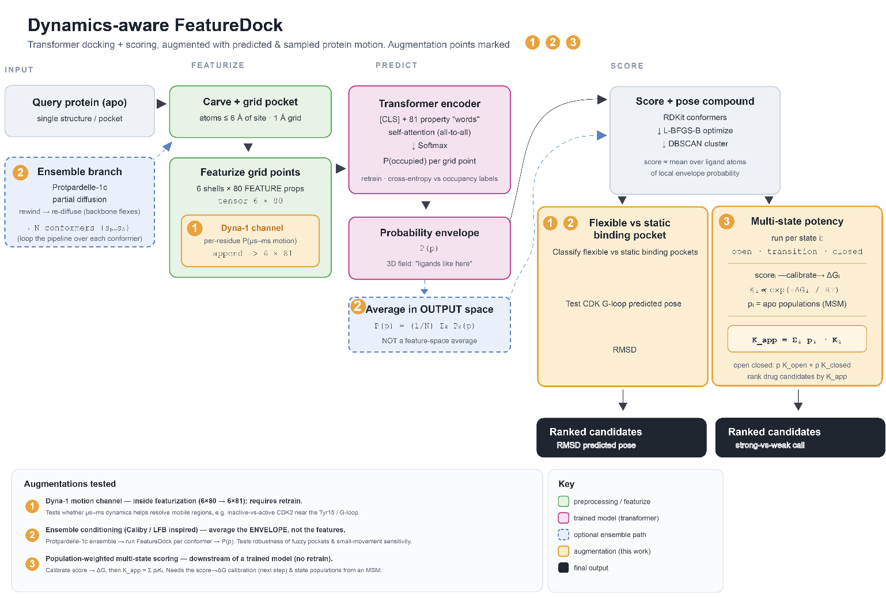

# Dynamics-aware FeatureDock

**Injecting predicted and sampled protein motion into structure-based docking** — so a
docking model can reason about pockets that *move*, not just the single frozen structure
it was handed.

📄 **Project page:** https://&lt;you&gt;.github.io/dynamics-aware-featuredock/



---

## What this is

Take **FeatureDock** — a transformer that predicts where a ligand will sit in a protein
pocket — and make it **dynamics-aware**: teach it not just the static shape of the pocket
but *how the pocket moves*, so it docks more reliably in flexible pockets where a single
crystal structure misleads it.

FeatureDock, as published, reads **one static structure** and predicts a ligand-occupancy
probability envelope over grid points in the pocket. That works when the pocket is rigid;
it struggles when the pocket **breathes** on the µs–ms timescale — exactly the motions a
crystal structure cannot show. The running example is **CDK2's G-loop / Tyr15 region**,
which rearranges between the kinase's active and inactive states.

## The three augmentations

| # | Augmentation | Where it acts | Retrain? |
|---|--------------|---------------|----------|
| ① | **Dyna-1 dynamics channel** — append per-residue µs–ms motion probability to the FEATURE tensor (`6×80 → 6×81`) | Featurization | **Yes** |
| ② | **Ensemble-conditioned envelope averaging** — run FeatureDock over a Protpardelle-1c conformer ensemble, average envelopes in *output* space | Output | No (head) |
| ③ | **Population-weighted multi-state scoring** — `K_app = Σᵢ pᵢ·Kᵢ`, `Kᵢ ∝ exp(−ΔGᵢ/RT)` | Scoring (downstream) | No |

## Built on three tools

| Tool | Role | Augmentation |
|------|------|--------------|
| [FeatureDock](https://github.com/xuhuihuang/featuredock) | Base model, rewritten & retrained | all |
| [Dyna-1](https://github.com/WaymentSteeleLab/Dyna-1) | Per-residue µs–ms motion channel | ① |
| [Protpardelle-1c](https://github.com/ProteinDesignLab/protpardelle-1c) | Conformer ensembles | ②, ③ |

## Data

- **Training:** PDBBind v2020 refined set (~4,515 preprocessed cocrystals), original 90%
  MMseqs2 cluster split (no homolog leakage across train/val). Grid points (millions) are
  the trainable records; the structure is the sampling unit for class balancing.
- **Evaluation:** ligand-pose RMSD to native (2 Å success threshold); strong-vs-weak
  discrimination (AUC / KL) from ChEMBL potencies (`CDK2 = CHEMBL301`, `ACE = CHEMBL1808`),
  stratified by pocket flexibility.

## Quick start

```bash
git clone https://github.com/<you>/dynamics-aware-featuredock.git
cd dynamics-aware-featuredock
bash setup_hackathon_mamba.sh      # Python 3.11 + modern PyTorch, all three tools
micromamba activate Hackathon
```

> The three upstream repos have incompatible declared pins (FeatureDock→py3.8,
> protpardelle-1c→py≥3.10). This project runs them together on a single modern stack;
> FeatureDock runs off its original py3.8/torch2.3 pins, and `torchtext` is dropped
> (unused, breaks on modern torch).

## Publishing the project page

The site lives in [`docs/`](docs/). To serve it with GitHub Pages:

1. Push this repo to GitHub.
2. **Settings → Pages → Build and deployment → Source: Deploy from a branch.**
3. Branch: `main`, folder: `/docs`. Save.
4. The page appears at `https://<you>.github.io/dynamics-aware-featuredock/` within a minute.

To preview locally: `python -m http.server -d docs` then open http://localhost:8000.

## References

- FeatureDock — *protein-ligand docking via physicochemical local-environment learning.* `doi:10.1038/s44386-025-00005-6`
- Dyna-1 — *Learning millisecond protein dynamics from what is missing in NMR spectra.* `biorxiv 2025.03.19.642801`
- Protpardelle-1c — *conditional all-atom protein structure generation.* `biorxiv 2025.08.18.670959`
- Caliby — *ensemble-conditioned protein sequence design.* `biorxiv 2025.09.30.679633`

---

> ⚠️ **The plots on the project page (Figures 2–3) are hypothetical results.** They are
> expected / hypothesized outcomes sketched during project design to show the *shape* of
> result the experiments are built to test — **not data from a trained model**. No model
> has been trained or evaluated yet.
