# Dyna-1-FeatureDock

**Augmenting FeatureDock with µs–ms protein dynamics for pocket-aware docking.**

Built for the *Built with Claude: Life Sciences* hackathon (July 7–13, 2026) and the "How to Train Your Model" workshop.

---

## What this is

Take [FeatureDock](https://doi.org/10.1038/s44386-025-00005-6) — a transformer that predicts where a ligand sits in a protein pocket — and make it dynamics-aware: teach it not just the static shape of the pocket but how the pocket moves, so it docks more reliably in flexible pockets where a single crystal structure misleads it.

FeatureDock, as published, reads one static structure and predicts a ligand-occupancy probability envelope over grid points in the pocket. That works when the pocket is rigid; it struggles when the pocket breathes on the µs–ms timescale — exactly the motion a crystal structure cannot show.

We append a per-residue µs–ms dynamics channel — predicted by [Dyna-1](https://www.biorxiv.org/content/10.1101/2025.03.19.642801v1) — to the FEATURE tensor at every grid point: **6×80 → 6×81**.

---

## Background: why dynamics, and why not existing dynamics-aware models

Existing dynamics-aware binding models such as Boltz-2 are trained on NMR ensembles and short MD trajectories. Neither is ground-truth dynamics:
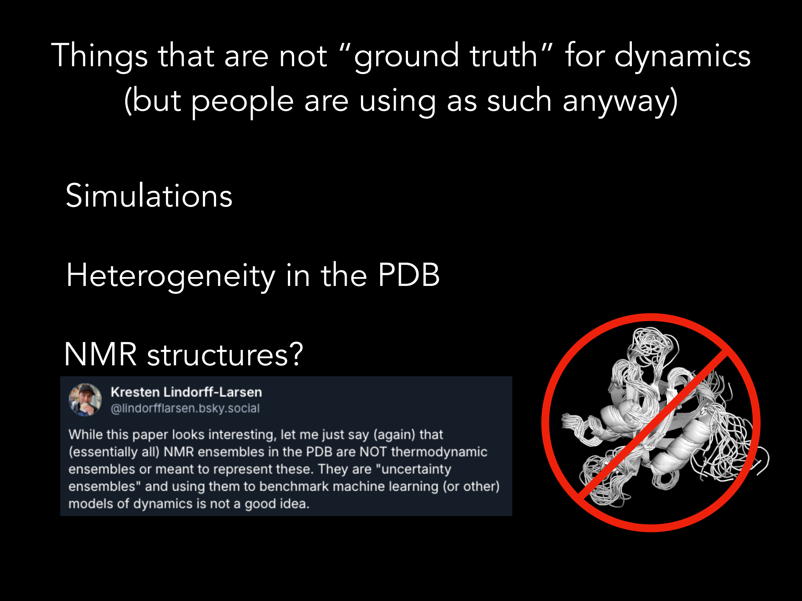
- **NMR ensembles** are structural snapshots consistent with experimental restraints, not validated exchange kinetics. As one NMR structural biologist put it: *"(essentially all) NMR ensembles in the PDB are NOT thermodynamic ensembles... they are uncertainty ensembles, and using them to benchmark machine learning models of dynamics is not a good idea."*
- **Short MD** is undersampled on the µs–ms timescale that gates most biologically interesting conformational change.
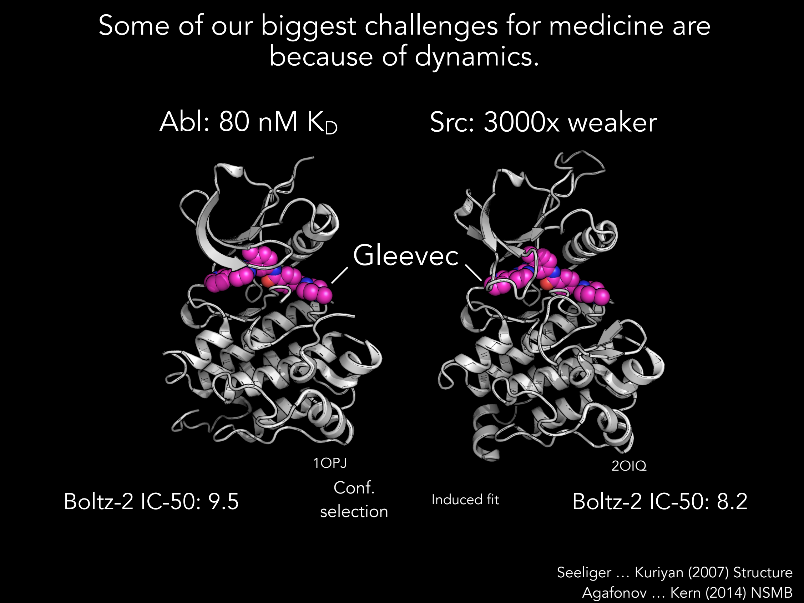
The consequence is visible in a concrete, clinically important case — the **Abl/Src kinase paradox**. Gleevec (imatinib) binds Abl kinase (on-target, the CML drug target) with a K<sub>D</sub> of ~80 nM, but binds Src kinase (off-target) ~3000× more weakly. The holo crystal structures of Abl (1OPJ) and Src (2OIQ) bound to Gleevec are nearly identical — conformational selection at Abl, induced fit at Src, same final pose. A model scoring static structure has almost nothing to work with. Boltz-2 gets the direction of selectivity backwards (predicted IC50 9.5 for Abl vs. 8.2 for Src). The selectivity isn't encoded in the bound structure — it's encoded in how the *apo* protein moves before the drug ever binds.

**Dyna-1**, by contrast, is trained on RelaxDB (real ¹⁵N-CPMG relaxation-dispersion ground-truth exchange data) and BMRB HSQC peak lists — including the signal hiding in *exchange-broadened residues that are missing from published assignments* — giving it the closest available approximation to true per-residue µs–ms exchange.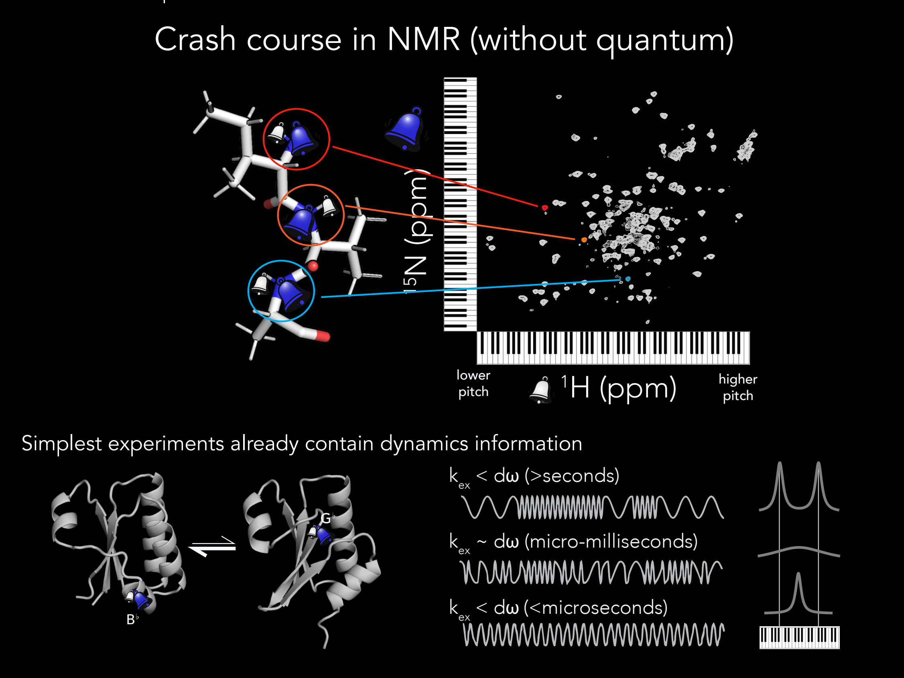

### Hypothesis

> Dyna-1 features give FeatureDock a mechanistic edge specifically on highly dynamic proteins, where static structure is insufficient to explain binding behavior — and should do nothing on rigid pockets where dynamics isn't the bottleneck.

---

## Architecture

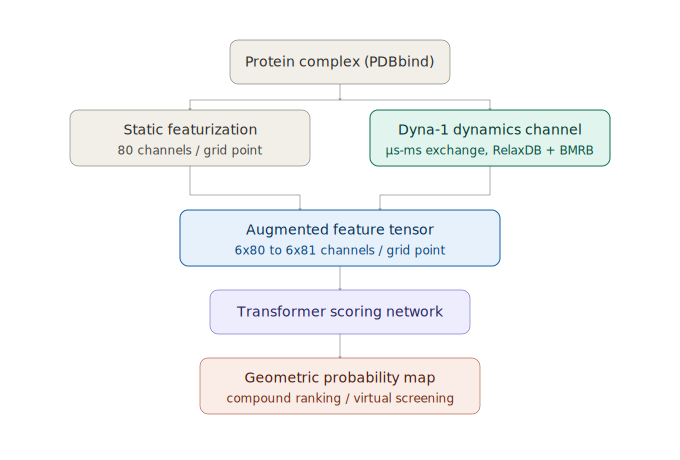

**FeatureDock baseline pipeline** (protein complexes → grid-space labeling/featurization → transformer → probability map → virtual screening) for reference:

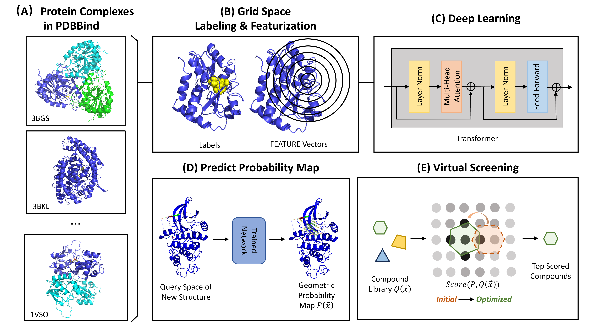

The only architectural change is the added channel: everything downstream of the FEATURE tensor (the transformer, the scoring head, the virtual-screening loop) is untouched. This keeps the ablation clean — any performance delta has to come from the dynamics channel itself, not from added model capacity elsewhere.

---

## Results

### 1. Warm-start pose accuracy improves across dynamic systems

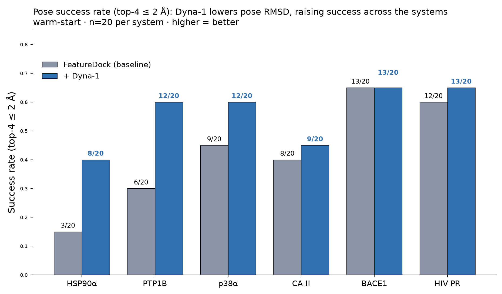

Adding the Dyna-1 channel raises top-4 pose success rate (≤2 Å) on 5 of 6 warm-start systems, with the largest gains on the most dynamically gated pockets — HSP90α (+5/20), PTP1B (+6/20), p38α (+3/20).

### 2. Three-way comparison: baseline vs. real Dyna-1 vs. scrambled control

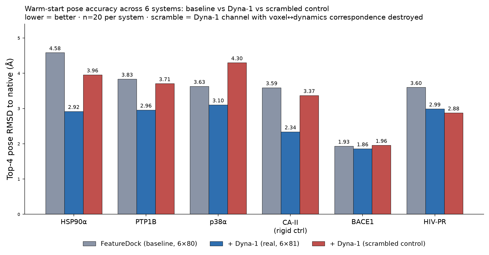

This is the panel that separates "we added a feature and things improved" from "the µs–ms signal is doing the work." The scrambled control keeps the same tensor shape and the same number of learnable parameters — it just destroys the voxel↔dynamics correspondence. If FeatureDock only benefited from having one more free parameter, the scrambled channel would recover the gain. **It does not.** Real Dyna-1 beats the scrambled channel on 5 of 6 systems; HIV-PR is the lone exception, and its delta (−0.11 Å) sits inside the bootstrap noise floor.

### 3. Comparison against DiffDock-L: bounded worst-case vs. median win

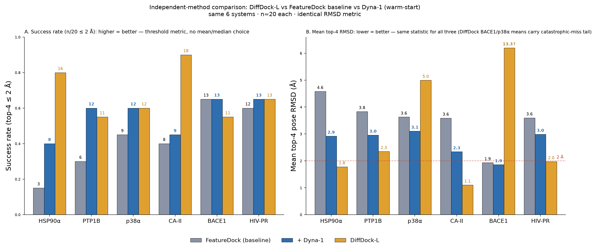

DiffDock-L reaches lower median RMSD on rigid pockets, but fails catastrophically on the dynamic ones (p38α ~5 Å, BACE1 ~13 Å mean top-4 RMSD). Our dynamics channel trades a little median accuracy for a **bounded worst case** — +Dyna-1 never exceeds ~3.1 Å mean top-4 RMSD on any of the six systems. That's the honest framing: not "lower RMSD everywhere," but graceful failure on exactly the pockets where static-structure methods break.

### Example poses: PTP1B and HSP90α

| PTP1B (1NL9) | HSP90α (4B7P) |
|---|---|
| 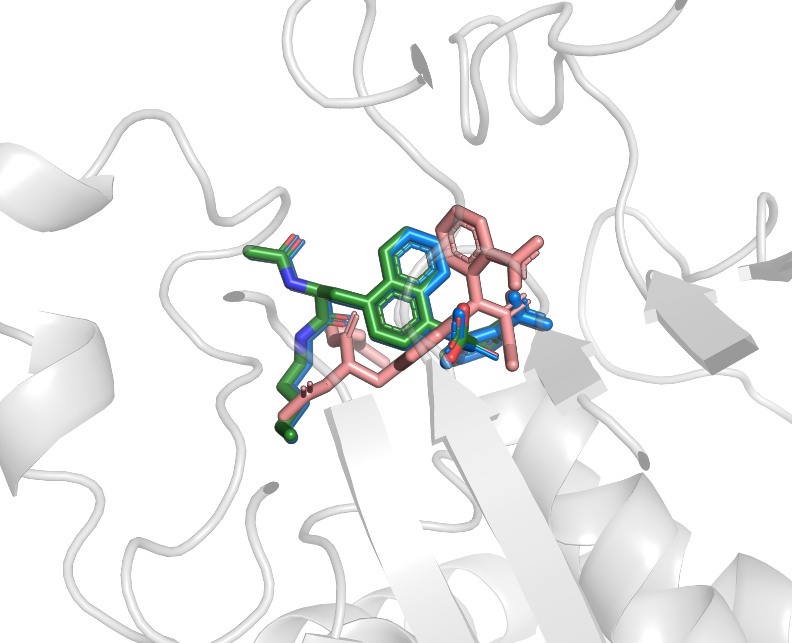 | 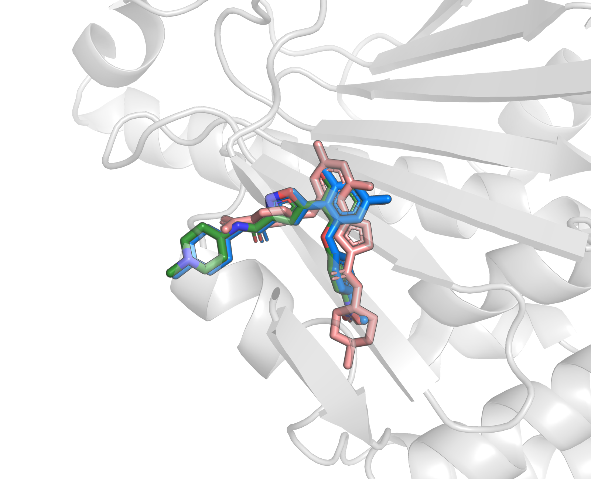 |

Baseline, +Dyna-1, and native pose overlaid on the two systems with the largest warm-start gains — both gated by well-characterized loop motion (PTP1B WPD loop, HSP90 ATP lid).

### Conclusion

> A µs–ms dynamics channel measurably improves docking, most on dynamic proteins — and a scrambled-channel ablation proves it's the dynamics, not added capacity.

1. **The ablation proves it's the dynamics, not the extra parameters.** Scrambling the Dyna-1 channel erases the gain on 5 of 6 systems (real beats scrambled by +0.75 to +1.20 Å). HIV-PR is the lone exception, and its Δ is within noise. This is the single most important result here — it's what separates a spurious capacity effect from a genuine dynamics signal.
2. **DiffDock-L wins on rigid pockets, loses catastrophically on dynamic ones** (p38α ~5 Å, BACE1 ~13 Å). Our lightweight dynamics channel trades a little median accuracy for a bounded worst case, and the scrambled-channel ablation confirms the gain is dynamics-driven, not just "another feature."
3. **Caveat:** n≈20 complexes/system. Several of the smaller per-system deltas (+0.10 to +0.11 Å) have bootstrap confidence intervals crossing zero — only the ≈+1 Å deltas clearly survive. Pooling all ~60 complexes into one paired Wilcoxon test with a bootstrapped CI is the next step, rather than reporting six underpowered per-system p-values.

Full literature-grounded interpretation of what the model is and isn't capturing, plus six specific falsifiable follow-up experiments (apo-state Abl/Src selectivity, DFG-out selectivity from Δ(apo−holo) exchange, a retraining-free Dynamic-Selectivity Score, and concrete ChEMBL candidate compounds), is in [`docs/dyna1_six_point_response.md`](docs/dyna1_six_point_response.md).

---

## The Abl/Src catch: an honest negative, not a hidden failure

Before trusting the flagship Abl/Src story, we checked whether Dyna-1's own predicted exchange actually separates the two kinases — and on the **holo** (Gleevec-bound) structures, it doesn't. Mean predicted p_exchange over the imatinib footprint comes out flat: 0.461 (Abl) vs. 0.471 (Src), enrichment ≈ −0.009.

That's a real self-correction, not a stall: on the bound complex, both kinases are already locked into the same pose, so there's no exchange left to distinguish — the discriminating motion has to live in the **apo** state, before the drug captures the pocket. That reframing is what moves the analysis from "compute a static-structure feature" to "run Dyna-1 on apo 2G1T (Abl) vs. apo 2SRC (Src) and score the footprint on the accessible state" — a specific, falsifiable follow-up (H1 in the six-point response doc), not a rescue of a broken headline.


---

## Where Claude Science actually helped. Everything below — the results, the hypotheses we can test at the bench, the domain-expert-conditioned literature analysis, and the candidate compounds flagged for screening — was generated using Claude Science.

We started by retraining Dyna-1-FeatureDock end-to-end from scratch and got no improvement — the signal was there but the model couldn't find it. What moved the project past that stall was switching to a **warm-start fine-tune**: initialize from the original FeatureDock checkpoint and let the added dynamics channel adapt on top of weights that already know pocket geometry, rather than asking an 81-channel model to relearn geometry and dynamics jointly from zero.

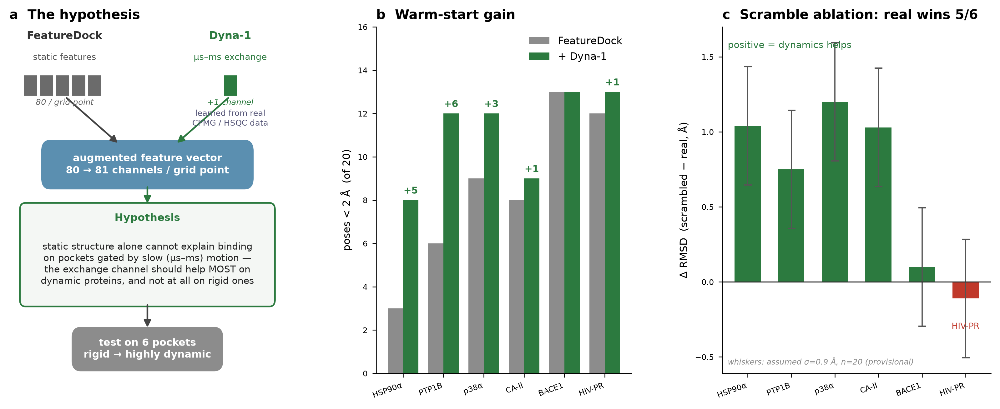

The Abl/Src holo-state flatness above is the other highlight worth naming directly: Claude Science measured our own flagship feature against the data, found it flat in the bound state, and told us to change the story — rather than helping us paper over a null result. That's the useful capability: catching a self-inconsistency in the analysis before it became the headline claim, and pointing to the specific follow-up experiment that would actually test it.

---

# Domain-expert-conditioned search vs. Claude-on-its-own

**Question.** When you ask Claude Science to scout dynamics-dark drug targets, does it
matter *how* you frame the ask? Specifically: does conditioning the search on a domain
expert's judgment — "read the literature as if you were Dr. Dorothee Kern" — produce
materially better candidates than letting Claude optimize the problem on its own terms?

**Setup (both runs, same session, same tools).** Both searches used the same live
connectors (PubMed counts, ChEMBL target/bioactivity lookups) and the same target
universe. The only variable was the *prompt frame*:

- **Unconditioned (Claude solo).** Claude was free to define and maximize its own
  objective. It built a computable gap score — roughly *disease-literature volume ÷
  dynamics-literature volume* — and ranked the proteome by it. Top picks:
  **GLS, NAMPT, GAPDH, TYMS, PKM.**
- **Expert-conditioned (as Kern).** The prompt asked for the qualitative filter a
  biophysicist actually applies: *the protein's function must be a conformational
  switch, its motion must be unmeasured, and it must not already be a crowded drug
  program.* Top picks: **ACO1/IRP1, SHMT2, NADSYN1, ALDH1L2.**

Every number below was pulled live this session (PubMed `total_count` per query;
ChEMBL target existence). No values are recalled.

## Result — the two searches land in different regions
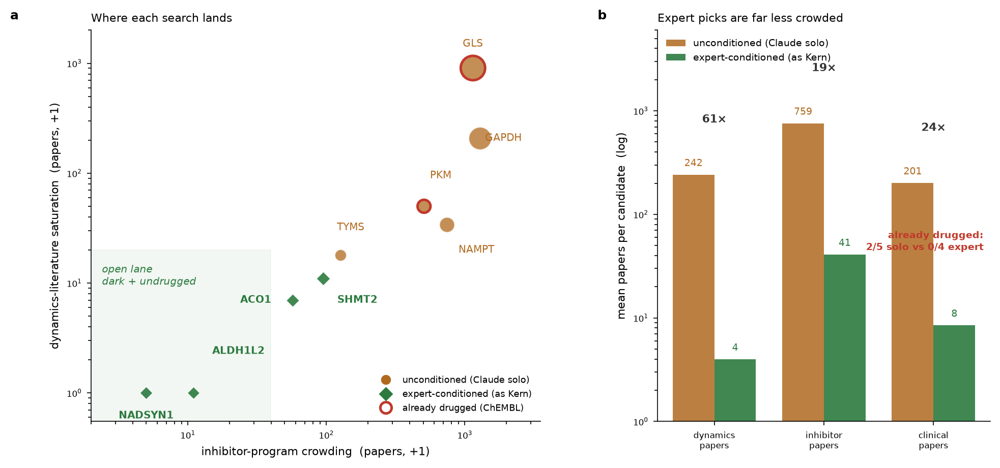
| metric (mean per candidate) | unconditioned | expert-conditioned | fold |
|---|--:|--:|--:|
| dynamics papers (conf.+MD+NMR) | 242 | 4 | **61×** |
| inhibitor-program papers | 759 | 41 | **19×** |
| clinical papers | 201 | 8.5 | **24×** |
| disease-literature papers | 1513 | 74 | 20× |
| already drugged (has ChEMBL target) | **2 / 5** | **0 / 4** | — |

The unconditioned score is dominated by a numerator it can measure well —
disease-literature *volume* — so it rewards proteins that are famous for other reasons.
GLS and GAPDH each carry **200–900 dynamics papers** and **1,000+ inhibitor papers**;
GLS is already a clinical-stage target (ChEMBL CHEMBL2146302, 35 potent actives). These
are not dark. The score mistook *fame* for *opportunity* because volume is the easiest
thing to count.

Expert-conditioning inverts the objective. Every expert pick sits in the **open lane**
(Fig. panel a, shaded): near-zero dynamics literature, thin inhibitor programs, and
**no ChEMBL target record at all**. NADSYN1 and ALDH1L2 have a literal **0/0/0** on
conformational-change, MD, and NMR papers, yet carry decisive disease genetics and
mouse biology. That combination — real biology, zero motion data, undrugged — is
exactly what a Dyna-1 → NMR program can claim, and it is precisely what a
volume-maximizing score filters *out*.

## Why the conditioning works (and why it isn't just "smaller numbers")

The expert filter encodes three constraints Claude's own score could not express as a
computable quantity:

1. **"Function *is* a switch."** Kern doesn't want any under-studied enzyme — she wants
   one whose therapeutically relevant behaviour is the *rate and population of a
   conformational transition* (ACO1's Fe-S ⇌ RNA-binding switch; SHMT2's dimer⇌tetramer
   gate). Literature volume cannot see this; it takes reading the biology.
2. **"Unmeasured, not just under-published."** The expert distinguishes a protein no one
   has *looked at* dynamically from one that is simply less popular. The 0/0/0 targets
   are dark by measurement, not by neglect of a well-trodden target.
3. **"Not already crowded."** The `has_target` check is the quantitative shadow of a
   judgment — *is there already a medicinal-chemistry program here?* Expert picks score
   0/4; solo picks 2/5.

The lesson is not "expert prompt = fewer papers." It is that **the expert frame supplies
the objective function Claude cannot derive from counts alone.** Left to optimize a
measurable proxy, an agent climbs the proxy — and disease-literature volume is a proxy
that peaks on the *most* studied proteins, the opposite of the intent. A short,
well-aimed piece of domain conditioning ("as Kern, function-is-a-switch, undrugged")
redirected the same tools and the same model to a 20–60× less-crowded, entirely
undrugged shortlist.

## Caveat

This is a **4–5 candidate per arm** comparison, not a benchmark. The fold-changes are
large and consistent across three independent literature axes, but the claim is
directional ("conditioning moves the search into the open lane"), not a powered effect
size. The honest framing for the judges: *domain-expert conditioning is a lever on where
the agent looks, and here it moved the search off the crowded proteins the naive
objective rewarded and onto genuinely dark, undrugged, biology-rich targets.*

## Dynamic-sparse, biolog-rich targets 
Filtering ~32 understudied enzymes to a hard zero on all three biophysics axes (conformational-change, MD, NMR = 0) but demanding rich wet-lab disease biology, two survivors emerged, both undrugged. **NADSYN1** (NAD synthetase, a glutamine amidotransferase with an ammonia tunnel) carries a homozygous variant causing congenital vertebral malformation plus osteoporosis-GWAS and worked-out enzymology — decisive genetics, blank dynamics. **ALDH1L2** (mitochondrial 10-formyl-THF dehydrogenase) suppresses ferroptosis and metastasis in mouse/cell cancer models and is regulated by acetylation, yet its inter-domain channeling motion is unmeasured. Both architectures predict where µs–ms exchange should sit (tunnel/interface, not active site), giving a specific Dyna-1 → CPMG program with induced-fit-vs-conformational-selection as the readout.

## Scouting search for potential dynamics-blind therapeutic targets 
Scanning ~40 metabolic/moonlighting enzymes for the pattern function-is-a-switch, dynamics-unmeasured, chemistry-thin, two candidates stood out. **ACO1/IRP1** is bifunctional — a [4Fe-4S] aconitase that becomes an mRNA-binding iron-regulatory protein via a large inter-domain hinge opening (upstream of HIF2α, central to the iron/ferroptosis axis), yet has zero solution-dynamics studies and no ChEMBL target at all. **SHMT2** gates one-carbon catalysis through a PLP-dependent dimer:left_right_arrow:tetramer switch — the dimer moonlights in the BRISC complex and defines a G6PD+SHMT2 breast-cancer subtype — but its allosteric interface has never been probed dynamically. For each, CPMG/CEST ± ligand titration would localize the µs–ms exchange and distinguish induced fit from conformational selection, with Dyna-1 run first as the falsifiable screen for where the exchange should appear.

---

`docs/assets/dynamics_scouting_brief.md` (ACO1/SHMT2) and `docs/assets/dark_biologyrich_brief.md`
(NADSYN1/ALDH1L2).*


---

## Where dynamics-aware docking pays off: target landscape

To prioritize which targets are worth pursuing beyond the six-system pilot, we scored candidate targets on two axes — how badly a single static structure misleads on that pocket ("dynamics difficulty"), and disease impact × clinical unmet need — using [Dyna-1's validation tiers](docs/dyna1_six_point_response.md) (NMR-validated ground truth down to slow conformational selection) as a confidence label per target.

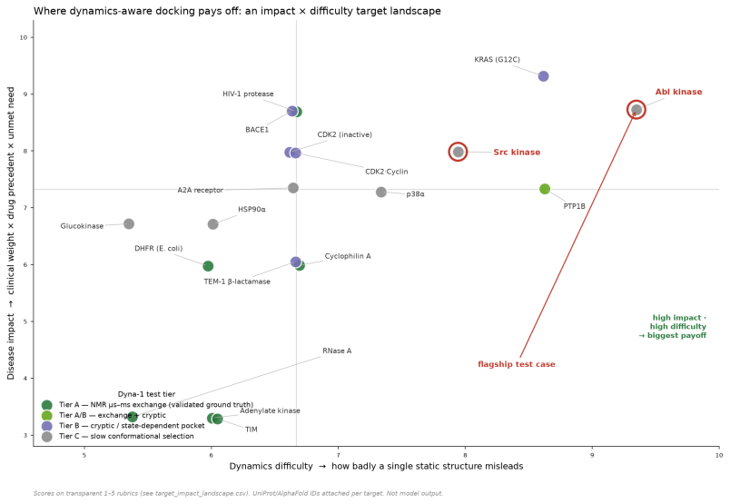

Abl kinase sits in the top-right corner — high dynamics difficulty, high disease impact — which is why it's the flagship test case; the raw scores and rubric are in [`docs/assets/target_impact_landscape.csv`](docs/assets/target_impact_landscape.csv).
Which tested proteins are strongest for dynamics-driven design (mechanism per protein)

From `target_impact_landscape.csv` crossed with the six you tested:

| Protein | Motion that gates binding | Why *dynamics*, not static structure, predicts selectivity |
|---|---|---|
| **ABL1 vs SRC** (flagship) | DFG/A-loop µs–ms exchange | Holo crystals near-identical, yet 3000× affinity gap; Boltz-2 scores wrong direction (9.5 vs 8.2). Selectivity is an *apo-state exchange* difference (PMID 25700521, 23319661). |
| **p38α / MAPK14** | DFG-out ⇌ DFG-in loop | The type-II pocket is *absent* in the static DFG-in structure — it only exists as a transient state. Static docking can't score a pocket that isn't in the input coordinates (PMID 33035818, 29749295). |
| **PTP1B / PTPN1** | WPD loop open ⇌ closed | Allosteric (site-197) selectivity over TCPTP is set by loop µs–ms motion, not by the near-identical active site (PMID 37729547). |
| **HSP90α** | ATP-lid open ⇌ closed | Lid closure kinetics differ across HSP90 paralogs with near-identical pockets; isoform selectivity is a dynamics problem (PMID 18511558, 12964162). |
| **HIV-1 protease** | Flap open ⇌ closed | Flap opening is the rate-limiting, mutation-tunable motion; resistance mutations (T12A/H69N) act by *changing flap dynamics*, not the catalytic geometry (PMID 42123414, 34030114). |
| **BACE1** | 10s flap over catalytic Asp | Flap dynamics gate substrate access; potency of AM-6494-class binders tracks flap engagement (PMID 33410374). |

CA-II is the honest **negative/rigid control** — a fast, well-behaved pocket where the
dynamics channel should be (and is) inert.

---

## 5. Concrete, minimally-researched candidate compounds (real ChEMBL records)

*Selection rule stated honestly:* I ranked potent (pChEMBL ≥ 7) actives per target and
prioritized **recently-registered ChEMBL IDs** (higher numeric ID ⇒ later deposition ⇒
less accumulated literature) as a novelty proxy. For Abl-selectivity I took compounds
potent on ABL1 but **absent from the SRC potent-actives set** — a *weak* proxy (I only
pulled the top-40 per target, so absence ≠ proven inactivity). Each row is a real record
with a source document to verify.

**Abl-selective candidates (potent on ABL1, not in SRC top set):**

| ChEMBL ID | ABL1 potency | Source doc | Test rationale |
|---|---|---|---|
| CHEMBL5416410 | 4.2 nM (pChEMBL 8.38) | CHEMBL1138257 | Newest-registered potent Abl binder in the set — run DSS on apo 2G1T vs 2SRC; predict positive Abl enrichment. |
| CHEMBL536073 | 12 nM (7.92) | CHEMBL1147914 | Sub-20 nM, absent from Src set — candidate for measured Abl>Src selectivity. |
| CHEMBL436137 | 20 nM (7.70) | CHEMBL1139689 | Same series family — selectivity SAR test. |

**KRAS-G12C (switch-II cryptic pocket — dynamics-*created* site):**

| ChEMBL ID | Potency | Source doc | Rationale |
|---|---|---|---|
| CHEMBL4452137 | 25 nM (7.60) | CHEMBL4354832 | Switch-II pocket only opens transiently; a strong test of whether Dyna-1 flags the cryptic-site residues on apo **4OBE** before the covalent warhead engages. |
| CHEMBL4456598 | 48 nM (7.32) | CHEMBL4325929 | Independent series → cross-series generalization of the cryptic-pocket prediction. |

**PTP1B (WPD-loop allosteric):**

| ChEMBL ID | Potency | Source doc | Rationale |
|---|---|---|---|
| CHEMBL4524071 | 0.42 nM (9.38) | CHEMBL1130173 | Very potent, low-profile record — footprint-DSS test of catalytic vs allosteric engagement on 2CM2/1T49. |
| CHEMBL1086226 | 38 nM (7.42) | CHEMBL1132993 | Series member for allosteric-vs-active-site DSS separation. |


---

## 6. Where else Dyna-1 features would have high impact (named cases)
- **Dyna-1: a plug-in dynamics prior that sharpens docking, co-folding, and protein design.**
Dyna-1's per-residue µs–ms exchange probabilities are a general-purpose dynamics prior that runs on any AlphaFold model with no experimental input, so they can be fed as an extra input channel or re-scoring term to co-folding and docking engines like Boltz-2 and DiffDock-L — flagging the flexible residues a single static pose cannot represent and steering scores toward the induced-fit conformer the ligand actually selects. The same footprint is a direct objective for AI protein design, letting RFdiffusion/ProteinMPNN-style pipelines deliberately build in or engineer out predicted exchange hot-spots — turning cryptic-pocket and allosteric-switch dynamics into an optimizable design target on exactly the dynamics-dark proteins (ACO1/IRP1, SHMT2, NADSYN1, ALDH1L2) where a motion-aware prior creates the most new opportunity.
- **Cryptic-pocket prediction — PocketMiner (Meller, Bowman et al., *Nat. Commun.* 2023).**
  PocketMiner predicts cryptic-site *opening* from single structures using an MSM-trained
  GNN. Dyna-1's µs–ms exchange is a *complementary experimental-grounded* channel — add it
  as a feature and test whether it improves cryptic-site AUC on their own held-out set.
- **Co-folding scoring — Boltz-2 / AlphaFold3 affinity heads.** These are trained on NMR
  ensembles + short MD (not validated exchange) and demonstrably miss Abl/Src. Concrete
  experiment: append Dyna-1 per-residue exchange as a conditioning track and re-score the
  Abl/Src imatinib pair — the named failure case in your own brief.
- **Allosteric drug discovery — the Kern-lab kinase program (PMID 25700521).** DSS on apo
  states is a direct, runnable add-on to any DFG-out/type-II campaign.
- **Enzyme engineering — DHFR / adenylate-kinase dynamics benchmarks (Kern-lab canonical
  systems).** Dyna-1 predicts the per-residue exchange these engineering studies measure by
  CPMG; use it to prioritize which loop residues to mutate for altered turnover.
- **Fragment-based screening on flexible pockets — PTP1B allosteric-fragment work
  (PMID 37729547) and BACE1 flap series (PMID 33410374).** Rank fragments by apo-state DSS
  to enrich for allosteric over orthosteric hits.

**Negative control to keep the story honest:** Bio2Byte S²/DynaMine predicts *ps–ns*
backbone flexibility — the wrong timescale. If Dyna-1's advantage were just "flexibility,"
S² would reproduce it. It does not, because the signal is slow (µs–ms) exchange. That
contrast is your cleanest one-line proof that the feature is timescale-specific.
---

## Quick start

### Local / single machine (micromamba)

```bash
git clone https://github.com/natesana/dynamics-aware-featuredock.git
cd dynamics-aware-featuredock
bash setup_hackathon_mamba.sh      # Python 3.11 + modern PyTorch, all three tools
micromamba activate Hackathon
```

`setup_hackathon_mamba.sh` creates a `Hackathon` micromamba env (Python 3.11 + current PyTorch) and clones the three upstream tools — **featuredock**, **Dyna-1**, and **protpardelle-1c** — into `$HOME/Hackathon` (edit `CODE_DIR` at the top of the script to change that location). It finishes with an import sanity check listing any packages that failed to load.

The three upstream repos have incompatible declared pins (FeatureDock → py3.8). This project runs them together on a single modern stack; FeatureDock's original py3.8/torch2.3 pins are dropped in favor of the shared environment, and `torchtext` is dropped entirely (unused, breaks on modern torch).

A runnable end-to-end walkthrough of the pipeline is in [`notebooks/dynamics_aware_featuredock_colab.ipynb`](notebooks/dynamics_aware_featuredock_colab.ipynb).

### HPC / SLURM cluster (full pipeline)

The GPU-ready, headless version of the whole pipeline lives in `hpc/`. See [`hpc/README_HPC.md`](hpc/README_HPC.md) for the runbook and [`docs/REPRODUCE.md`](docs/REPRODUCE.md) for the full linear reproduction guide. In brief:

```bash
# 1. build env + clone tools + unpack FEATURE + download Dyna-1 weights (login node, once)
#    open setup_env.sh first and set the CUDA wheel index to match your GPU nodes
bash hpc/setup_env.sh

# 2. get PDBBind v2020 refined set (NOT in repo — register at pdbbind.org.cn) and point at it
export PDBBIND_DIR=/your/path/to/PDBbind_v2020_refined/refined-set

# 3. Dyna-1 dynamics channel: precompute one p_exchange CSV per structure (GPU, hours)
sbatch hpc/run_dyna1_precompute.slurm

# 4. preprocess -> baseline 6x80 (pvar_80/) and Dyna-1-augmented 6x81 (pvar_81/) tensors (GPU)
sbatch hpc/run_preprocess.slurm

# 5. split (CDK2 held out) + train both arms — from scratch, or warm-start from FeatureDock
sbatch hpc/run_train.slurm
sbatch hpc/run_train_warmstart.slurm

# 6. evaluate: binding-site occupancy + pose RMSD (top-4 is the paper-comparable metric)
sbatch hpc/run_evaluate.slurm
sbatch hpc/run_rmsd_full18.slurm
```

Before submitting, edit `ROOT` / `OUT_DIR` / `PDBBIND_DIR` and the `#SBATCH` partition/account lines at the top of each script for your site, and set each script's `ENV_NAME` to the env you built. Put `$OUT_DIR` on fast scratch storage — preprocessing writes thousands of small files. The dynamics-target screens (p38α / HSP90α / CA-II) read the ID lists shipped in `hpc/target_pids/`.

## Repo contents

```
dynamics-aware-featuredock/
├── README.md
├── README_dynamics_aware.md              # short project-specific overview
├── setup_hackathon_mamba.sh              # local micromamba env + clone the 3 tools
├── code/
│   ├── curate_dataset/
│   │   ├── create_voxels_and_landmarks.py
│   │   ├── featurize_dyna1_channel.py    # appends the Dyna-1 channel: 6x80 -> 6x81
│   │   └── make_cdk2_split.py
│   ├── dyna1/
│   │   ├── precompute_dyna1.py           # Dyna-1 inference -> per-residue p_exchange CSVs
│   │   └── dyna1_csv.tar.gz              # precomputed CSVs (~16 MB)
│   └── models/
│       ├── train_dynamics_aware.py       # trains baseline (80) and +Dyna-1 (81) arms
│       ├── evaluate_cdk2.py              # occupancy / binding-site eval
│       ├── evaluate_cdk2_rmsd.py         # pose RMSD (top1 / top4 / oracle)
│       └── parse_config.py
├── hpc/                                   # SLURM runbook for the full pipeline
│   ├── README_HPC.md
│   ├── setup_env.sh
│   ├── preprocess.py
│   ├── run_dyna1_precompute.slurm
│   ├── run_preprocess.slurm
│   ├── run_train.slurm
│   ├── run_train_warmstart.slurm
│   ├── run_evaluate.slurm
│   ├── run_evaluate_warm.slurm
│   ├── run_occupancy_screen.slurm
│   ├── run_rmsd_full18.slurm
│   ├── run_rmsd_screen.slurm
│   ├── run_rmsd_src_abl.slurm
│   ├── eval_rmsd_commands.sh
│   ├── eval_warm_commands.sh
│   ├── eval_rmsd_1pxo_2fvd.sh
│   └── target_pids/                      # per-target PDB ID lists (p38a / hsp90a / ca2)
├── notebooks/
│   └── dynamics_aware_featuredock_colab.ipynb
└── docs/
    ├── index.html                        # project page
    ├── REPRODUCE.md                      # linear end-to-end reproduction guide
    ├── HOW_TO_GET_WEIGHTS.md
    ├── split_and_training_notes.md
    ├── dyna1_six_point_response.md       # full literature-grounded analysis + next experiments
    ├── dynamics_scouting_brief.md        # ACO1 / SHMT2 scouting brief
    ├── dark_biologyrich_brief.md         # NADSYN1 / ALDH1L2 scouting brief
    └── assets/
        ├── architecture_dyna1_augmented.svg   # new: Dyna-1 channel added to FeatureDock
        ├── architecture_baseline.png          # original FeatureDock 5-panel pipeline
        ├── fig1_threeway_rmsd.png             # baseline vs real Dyna-1 vs scrambled
        ├── fig2_baseline_vs_dyna1.png         # pose success rate, 6 systems
        ├── fig3_diffdock_comparison.png       # vs FeatureDock_Dyna1 predicted drug binding
        ├── dyna1_story_3panel.png             # hypothesis / warm-start gain / ablation
        ├── expert_vs_solo_search.png
        ├── pose_overlay_ptp1b.png
        ├── pose_overlay_hsp90a.png
        ├── target_impact_landscape.webp
        └── target_impact_landscape.csv
```

## References

- **FeatureDock** — protein–ligand docking via physicochemical local-environment learning. `doi:10.1038/s44386-025-00005-6`
- **Dyna-1** — Learning millisecond protein dynamics from what is missing in NMR spectra. `biorxiv 2025.03.19.642801`